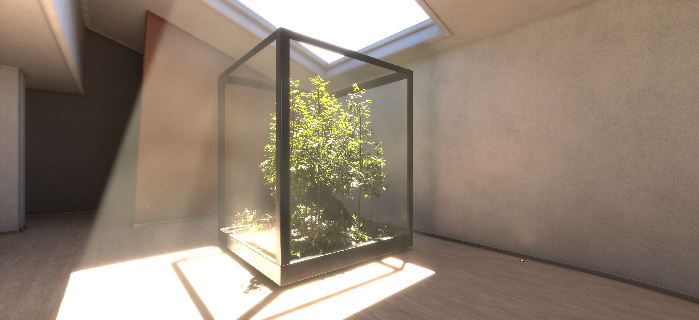
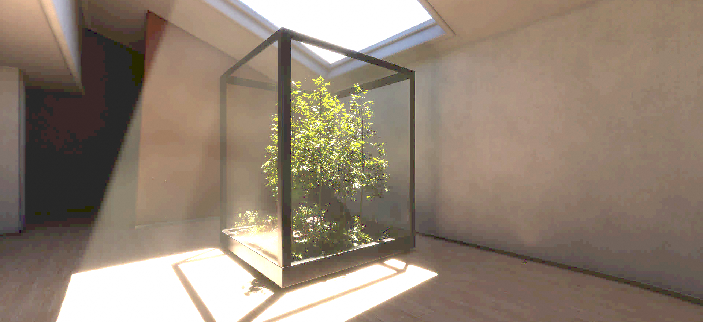

# Unity JPEG compression (DCT) post-processing | HDRP

DCT (Discrete cosine transform) post-processing for reproduce JPEG artifacts compression rendering. Compatible with HDRP.

## How to use:
Go to Project Settings > Graphics > HDRP Global Settings > Custom Post Process Order. Add it under After Post Process.
Add the post-processing to a post-process volume.
Define your compression level. The lower the level, the smaller the frequency space will be, which increases JPEG compression artifacts.

